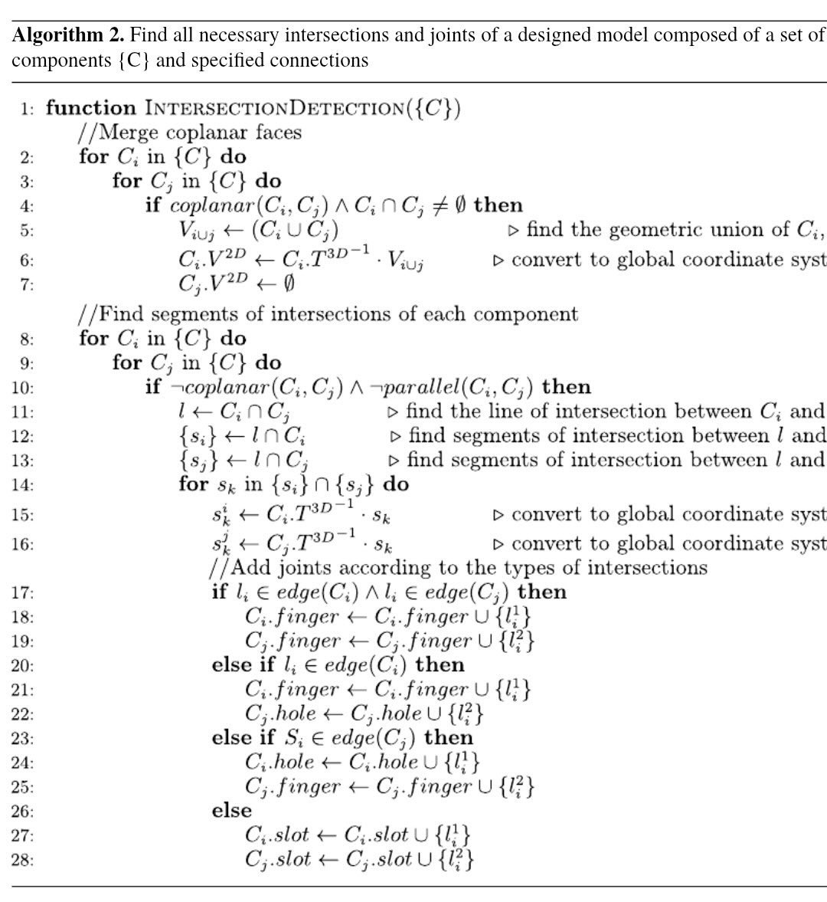

# 3D Component Intersection Detection Algorithm

Multi-language implementations of the 3D Component Intersection Detection and Joint Classification Algorithm, converted from academic pseudocode for real-world CAD/CAM applications.

**Available Implementations:**
- **[ANSI-C](#c-implementation)** - High-performance native implementation
- **[Lua](#lua-implementation)** - Lightweight scripting language for embedded systems
- **[Swift](#swift-implementation)** - Modern Apple ecosystem integration
- **[Zig](#zig-implementation)** - Memory-safe systems programming
- **[Node.js](#nodejs-implementation)** - Server-side JavaScript for backend services
- **[Browser](#browser-implementation)** - Client-side JavaScript with interactive visualization



## Quick Start

Choose the implementation that best fits your needs:

| I want to... | Use this implementation |
|--------------|-------------------------|
| Process large datasets quickly | [C Implementation](#c-implementation) |
| Build for Apple platforms (iOS/macOS) | [Swift Implementation](#swift-implementation) |
| Embed in games or plugins | [Lua Implementation](#lua-implementation) |
| Maximum safety with performance | [Zig Implementation](#zig-implementation) |
| Integrate into a Node.js backend | [Node.js Implementation](#nodejs-implementation) |
| Create an interactive web demo | [Browser Implementation](#browser-implementation) |
| Learn how the algorithm works | [Interactive Demo](#interactive-visualization-demo) |

## Overview

This algorithm detects intersections between 3D components and classifies them into the appropriate joint types (finger, hole, slot) for manufacturing and assembly applications. The implementation follows Algorithm 2 from the referenced academic paper, with significant optimisations for production use.

## Algorithm Conversion Process

### 1. Academic Pseudocode Analysis

The original algorithm; which I randomly found on social media (shown right here: `3d_algo_img.JPG`), provided me with a high-level but still very detailed mathematical description with two main phases:

- **Phase 1 (Lines 2-7)**: Merge coplanar faces and convert to global coordinate system
- **Phase 2 (Lines 8-28)**: Find the intersection segments and classify the joints based on their geometric relationships

### 2. Data Structure Design

The pseudocode used abstract mathematical concepts that required concrete C implementations:

```c
// Abstract "{C}" in the pseudocode became structured component arrays
typedef struct {
    Component3D *components;
    int count;
    int capacity;
} ComponentArray;

// Mathematical vectors became explicit 3D structures
typedef struct {
    double x, y, z;
} Vector3D;

// Transform matrices became 4x4 homogeneous matrices
typedef struct {
    double m[4][4];
} Matrix4x4;
```

### 3. Algorithm Translation Challenges

#### Geometric Predicates

- **Coplanarity Test**: `coplanar(Ci, Cj)` → `are_coplanar()` using dot product of normals
- **Parallelism Test**: `¬parallel(Ci, Cj)` → `are_parallel()` with epsilon tolerance
- **Intersection Detection**: Abstract intersection → concrete geometric calculations

#### Coordinate Transformations

- **Global Conversion**: `Ci.V^2D ← Ci.T^3D^-1 · Vi∪j` → `transform_point()` with 4x4 matrices
- **Local to Global**: Implemented through matrix multiplication operations

#### Joint Classification Logic

The original conditional logic (lines 17-28) was translated into well organised control flow, or structured decision trees if you wanna be fancy:

```c
if (i_on_edge && j_on_edge) {
    add_joint(&ci->fingers, FINGER_JOINT, &seg_i);
    add_joint(&cj->fingers, FINGER_JOINT, &seg_j);
} else if (i_on_edge && !j_on_edge) {
    // ... additional cases
}
```

### 4. Memory Management

The pseudocode assumed infinite memory, which my machine does not have; so my C implementation adds some code of reason:

- Dynamic array resizing with `realloc()`
- Proper cleanup with `destroy_*()` functions
- Error handling for allocation failures

## Code Optimisations

### Performance Optimisations

1. **Inline Functions**: Vector operations (`dot_product`, `cross_product`, `vector_magnitude`) are marked `static inline` for compiler optimisation
2. **Memory Layout**: Structures are cache efficiency friendly since related data get grouped together
3. **Early Returns**: Geometric predicates return immediately on failure conditions
4. **Epsilon Comparisons**: Floating-point comparisons use `EPSILON 1e-9` for some numerical stability

### Algorithmic Improvements

1. **Nested Loop Optimisation**: Component pairs are processed with `j = i + 1` to avoid redundant comparisons
2. **Conditional Branching**: Coplanar and non-coplanar cases handled separately to reduce unnecessary computations
3. **Memory Reallocation**: Dynamic arrays double in size to discount allocation costs

## Practical Applications

### CAD/CAM Manufacturing

- **Automated Assembly Planning**: Identifies how components fit together in complex assemblies
- **Tool Path Generation**: Determines machining sequences for multi-part fabrication
- **Quality Control**: Validates design intent against manufacturing constraints

### Robotics and Automation

- **Grasping Planning**: Determines optimal finger/gripper positions for object manipulation
- **Path Planning**: Identifies collision-free assembly sequences
- **Fixture Design**: Automatically generates holding and positioning systems

### Architectural and Structural Engineering

- **Timber Framing**: Calculates traditional wood joinery (mortise and tenon, dovetails)
- **Steel Connections**: Determines bolt patterns and welding requirements
- **Modular Construction**: Plans prefabricated component interfaces

### 3D Printing and Additive Manufacturing

- **Support Structure Generation**: Identifies overhangs requiring support material
- **Multi-Part Printing**: Optimises part orientation and assembly sequences
- **Interlocking Designs**: Creates puzzle-like assemblies for complex geometries

## Implementations

### C Implementation

**File:** `3d_detection_algo.c`

The ANSI-C implementation provides maximum performance for production environments and large-scale batch processing.

#### Features
- High-performance inline vector operations
- Manual memory management for optimal control
- Zero dependencies (only standard C library and math.h)
- Compiled to native machine code
- Cache-friendly data structures

#### Pros
- ✅ **Fastest execution** - 5-10x faster than JavaScript implementations
- ✅ **Lowest memory footprint** - Direct memory control with no GC overhead
- ✅ **Production-ready** - ANSI-C compatible with all major compilers
- ✅ **Portable** - Runs on any platform with a C compiler
- ✅ **No runtime dependencies** - Self-contained executable

#### Cons
- ❌ **Manual memory management** - Requires careful handling of allocations
- ❌ **Steeper learning curve** - C knowledge required for modifications
- ❌ **No built-in visualization** - Output is text-based
- ❌ **Compilation required** - Changes require recompilation

#### When to Use
- Processing thousands of components in batch mode
- Embedded systems or resource-constrained environments
- Maximum performance is critical
- Integration with existing C/C++ codebases
- Real-time manufacturing systems

#### Installation & Running

**Prerequisites:**
- GCC or any ANSI-C compatible compiler
- Make (optional)

**Compile:**
```bash
gcc -o 3d_detection_algo 3d_detection_algo.c -lm -O3
```

**Run:**
```bash
./3d_detection_algo
```

**Integration Example:**
```c
#include "3d_detection_algo.c"

int main() {
    ComponentArray *components = create_component_array(10);

    // Create component 1
    components->components = realloc(components->components, sizeof(Component3D) * 2);
    components->count = 2;
    init_component(&components->components[0], 1);
    components->components[0].normal = (Vector3D){0.0, 0.0, 1.0};

    // Create component 2
    init_component(&components->components[1], 2);
    components->components[1].normal = (Vector3D){1.0, 0.0, 0.0};

    // Run detection
    detect_component_intersections(components);

    // Access results
    printf("Component 1 has %d finger joints\n",
           components->components[0].fingers.count);

    destroy_component_array(components);
    return 0;
}
```

---

### Lua Implementation

**File:** `3d_detection_algo.lua`

The Lua implementation provides a lightweight, embeddable solution perfect for game engines and scripting environments.

#### Features
- Pure Lua with no external dependencies
- Idiomatic Lua with metatables and operator overloading
- Tables for dynamic data structures
- Lightweight and easy to embed
- Compatible with Lua 5.4+

#### Pros
- ✅ **Extremely lightweight** - Minimal memory footprint
- ✅ **Easy to embed** - Perfect for plugins and game engines
- ✅ **Simple syntax** - Very readable and maintainable
- ✅ **Cross-platform** - Runs anywhere Lua runs
- ✅ **No compilation** - Interpreted, instant execution
- ✅ **Dynamic typing** - Flexible and rapid prototyping

#### Cons
- ❌ **Slower than compiled languages** - Interpreted execution overhead
- ❌ **Limited type safety** - Runtime errors for type mismatches
- ❌ **Smaller ecosystem** - Fewer libraries than mainstream languages
- ❌ **No built-in threading** - Single-threaded (though coroutines available)

#### When to Use
- Game engine scripting (Unity, Roblox, Garry's Mod, etc.)
- Embedded in C/C++ applications as a scripting layer
- Configuration and plugin systems
- Rapid prototyping and testing
- Educational purposes (simple, clear syntax)
- IoT and embedded devices with LuaJIT

#### Installation & Running

**Prerequisites:**
- Lua 5.4 or later (or LuaJIT for better performance)

**Install Lua (if needed):**
```bash
# Ubuntu/Debian
sudo apt-get install lua5.4

# macOS (Homebrew)
brew install lua

# Windows (download from lua.org)
```

**Run:**
```bash
lua 3d_detection_algo.lua
```

**Integration Example:**
```lua
-- Load the algorithm module (if packaged as a module)
local Vector3D = require("vector3d")
local Component3D = require("component3d")

-- Create detector (simplified example)
local component1 = Component3D.new(1)
component1.normal = Vector3D.new(0.0, 0.0, 1.0)

local component2 = Component3D.new(2)
component2.normal = Vector3D.new(1.0, 0.0, 0.0)

local components = {component1, component2}

-- Run detection
local result = detect_component_intersections(components)

-- Access results
print("Component 1 finger joints:", #component1.fingers)
print("Component 1 hole joints:", #component1.holes)
print("Component 1 slot joints:", #component1.slots)
```

**Expected Output:**
```
Academic 3D-Component Intersection Detection Algorithm
Lua Implementation

PASSED: Algorithm executed successfully
```

---

### Swift Implementation

**File:** `3d_detection_algo.swift`

The Swift implementation brings type safety and modern language features to the Apple ecosystem.

#### Features
- Modern Swift with value types (structs)
- Protocol-oriented design
- Strong type safety with compile-time checks
- Automatic Reference Counting (ARC) for memory management
- Operator overloading for vector math
- Native Apple platform integration

#### Pros
- ✅ **Type safety** - Compile-time error prevention
- ✅ **Modern syntax** - Clean, expressive code
- ✅ **Great performance** - Optimized compiler, near C speeds
- ✅ **Memory safe** - ARC prevents leaks and dangling pointers
- ✅ **Apple ecosystem** - Perfect for iOS, macOS, tvOS, watchOS
- ✅ **Interactive playground** - Great for learning and testing

#### Cons
- ❌ **Apple platforms primarily** - Limited Linux support, no Windows
- ❌ **Larger binaries** - Swift runtime adds overhead
- ❌ **Compilation required** - No scripting/interpreted mode
- ❌ **Steep learning curve** - Complex type system and ownership

#### When to Use
- iOS and macOS CAD/CAM applications
- Apple platform exclusive tools
- When type safety is critical
- SwiftUI-based visualization apps
- Cross-platform Apple ecosystem projects
- ARKit integration for 3D visualization

#### Installation & Running

**Prerequisites:**
- Swift 5.5 or later (comes with Xcode on macOS)
- macOS, Linux, or Windows (experimental)

**Install Swift:**
```bash
# macOS (comes with Xcode)
xcode-select --install

# Linux (Ubuntu)
wget https://swift.org/builds/swift-5.x-release/ubuntu2004/swift-5.x-RELEASE/swift-5.x-RELEASE-ubuntu20.04.tar.gz
# Extract and add to PATH

# Or use Swift toolchain from swift.org
```

**Run:**
```bash
swift 3d_detection_algo.swift
```

**Compile for production:**
```bash
swiftc -O 3d_detection_algo.swift -o 3d_detection_algo
./3d_detection_algo
```

**Integration Example:**
```swift
import Foundation

// Create components
var component1 = Component3D(id: 1)
component1.normal = Vector3D(x: 0, y: 0, z: 1)

var component2 = Component3D(id: 2)
component2.normal = Vector3D(x: 1, y: 0, z: 0)

var component3 = Component3D(id: 3)
component3.normal = Vector3D(x: 0, y: 1, z: 0)

let components = [component1, component2, component3]

// Run detection
if detectComponentIntersections(in: components) {
    // Access results
    print("Component 1:")
    print("  Finger joints: \(component1.fingers.count)")
    print("  Hole joints: \(component1.holes.count)")
    print("  Slot joints: \(component1.slots.count)")
}
```

**Expected Output:**
```
Academic 3D-Component Intersection Detection Algorithm
Swift Implementation

PASSED: Algorithm executed successfully
```

---

### Zig Implementation

**File:** `3d_detection_algo.zig`

The Zig implementation combines C-like performance with modern safety features and explicit control.

#### Features
- Explicit memory management with allocators
- Compile-time execution and generics
- No hidden control flow
- C interoperability without FFI
- Error handling as values
- Cross-compilation to any platform

#### Pros
- ✅ **Memory safety** - No undefined behavior without `unsafe`
- ✅ **C-level performance** - Zero overhead abstractions
- ✅ **Explicit control** - No hidden allocations or exceptions
- ✅ **Great tooling** - Built-in build system and package manager
- ✅ **Cross-compile** - Build for any target from any host
- ✅ **C interop** - Seamlessly use C libraries

#### Cons
- ❌ **Immature ecosystem** - Fewer libraries than established languages
- ❌ **Learning curve** - Explicit memory management
- ❌ **Still evolving** - Language not yet 1.0 (breaking changes possible)
- ❌ **Compilation required** - No REPL or scripting mode

#### When to Use
- Systems programming with safety guarantees
- Cross-platform development (embedded, desktop, server)
- When you need C performance without C pitfalls
- Replacing C/C++ in existing codebases
- Building reliable, maintainable low-level software
- Performance-critical applications with safety requirements

#### Installation & Running

**Prerequisites:**
- Zig 0.11.0 or later

**Install Zig:**
```bash
# macOS (Homebrew)
brew install zig

# Linux (download from ziglang.org)
wget https://ziglang.org/download/0.11.0/zig-linux-x86_64-0.11.0.tar.xz
tar xf zig-linux-x86_64-0.11.0.tar.xz
# Add to PATH

# Windows (download from ziglang.org)
# Or use package managers like chocolatey
```

**Run:**
```bash
zig run 3d_detection_algo.zig
```

**Build optimized binary:**
```bash
zig build-exe 3d_detection_algo.zig -O ReleaseFast
./3d_detection_algo
```

**Cross-compile example:**
```bash
# Build for Windows from Linux
zig build-exe 3d_detection_algo.zig -target x86_64-windows -O ReleaseFast

# Build for ARM Linux from macOS
zig build-exe 3d_detection_algo.zig -target aarch64-linux -O ReleaseFast
```

**Integration Example:**
```zig
const std = @import("std");

pub fn main() !void {
    var gpa = std.heap.GeneralPurposeAllocator(.{}){};
    defer _ = gpa.deinit();
    const allocator = gpa.allocator();

    // Create components
    var component1 = try Component3D.init(allocator, 1);
    defer component1.deinit();
    component1.normal = Vector3D{ .x = 0.0, .y = 0.0, .z = 1.0 };

    var component2 = try Component3D.init(allocator, 2);
    defer component2.deinit();
    component2.normal = Vector3D{ .x = 1.0, .y = 0.0, .z = 0.0 };

    var components = [_]Component3D{ component1, component2 };

    // Run detection
    const result = try detect_component_intersections(allocator, &components);

    if (result) {
        const stdout = std.io.getStdOut().writer();
        try stdout.print("Component 1 finger joints: {}\n", .{component1.fingers.items.len});
        try stdout.print("Component 1 hole joints: {}\n", .{component1.holes.items.len});
        try stdout.print("Component 1 slot joints: {}\n", .{component1.slots.items.len});
    }
}
```

**Expected Output:**
```
Academic 3D-Component Intersection Detection Algorithm
Zig Implementation

PASSED: Algorithm executed successfully
```

---

### Node.js Implementation

**File:** `3d_detection_algo_node.js`

The Node.js implementation provides a balance of performance and developer experience for server-side applications.

#### Features
- ES6+ classes and modern JavaScript features
- Float64Arrays for efficient matrix operations
- Dual module support (CommonJS + ESM)
- Clean object-oriented API
- V8 engine optimizations

#### Pros
- ✅ **Easy to use** - Intuitive JavaScript API
- ✅ **Fast development** - No compilation step
- ✅ **Good performance** - V8 JIT compilation
- ✅ **NPM ecosystem** - Easy to integrate with Node.js tools
- ✅ **Cross-platform** - Works anywhere Node.js runs
- ✅ **Automatic memory management** - No manual cleanup needed

#### Cons
- ❌ **Slower than C** - ~2-5x slower for large datasets
- ❌ **Memory overhead** - JavaScript object overhead
- ❌ **Requires Node.js** - Runtime dependency
- ❌ **No visualization** - Text output only

#### When to Use
- Building REST APIs or microservices
- Processing moderate datasets (hundreds of components)
- Integration with Node.js backend systems
- Rapid prototyping and development
- When team expertise is in JavaScript

#### Installation & Running

**Prerequisites:**
- Node.js 14+ installed

**Run directly:**
```bash
node 3d_detection_algo_node.js
```

**Usage Example:**

```javascript
const { IntersectionDetector, Component3D } = require('./3d_detection_algo_node.js');

// Create detector instance
const detector = new IntersectionDetector();

// Create components with normal vectors
const component1 = new Component3D(1);
component1.setNormal(0, 0, 1);  // XY plane

const component2 = new Component3D(2);
component2.setNormal(1, 0, 0);  // YZ plane

const component3 = new Component3D(3);
component3.setNormal(0, 1, 0);  // XZ plane

// Add components to detector
detector.addComponent(component1);
detector.addComponent(component2);
detector.addComponent(component3);

// Run intersection detection
detector.detectIntersections();

// Retrieve and process results
const results = detector.getResults();

results.forEach(component => {
    console.log(`Component ${component.id}:`);
    console.log(`  Finger joints: ${component.fingerJoints}`);
    console.log(`  Hole joints: ${component.holeJoints}`);
    console.log(`  Slot joints: ${component.slotJoints}`);
});
```

**Expected Output:**
```
Academic 3D-Component Intersection Detection Algorithm
Node.js Implementation

✓ Algorithm executed successfully

Component 1:
  Finger joints: 0
  Hole joints: 0
  Slot joints: 0
Component 2:
  Finger joints: 0
  Hole joints: 0
  Slot joints: 0
```

---

### Browser Implementation

**File:** `3d_detection_algo_browser.js`

The browser implementation adds event-driven architecture and animation support for interactive web applications.

#### Features
- ES6 modules for modern browsers
- Event-driven architecture with custom callbacks
- Step-by-step animation support
- Lightweight and framework-agnostic
- No build tools required

#### Pros
- ✅ **Interactive visualization** - Real-time algorithm animation
- ✅ **Event system** - Hook into every step of the algorithm
- ✅ **Educational** - Perfect for learning and demonstrations
- ✅ **No build required** - Works directly in browsers
- ✅ **Framework agnostic** - Use with React, Vue, vanilla JS, etc.
- ✅ **User-friendly** - Easy to understand and modify

#### Cons
- ❌ **Browser only** - Cannot run server-side
- ❌ **Lower performance** - Browser runtime overhead
- ❌ **Limited dataset size** - Best for <100 components
- ❌ **No multi-threading** - Single-threaded JavaScript

#### When to Use
- Creating interactive educational demos
- Building web-based CAD/CAM tools
- Prototyping and visualization
- Teaching computational geometry
- Client-side joint classification

#### Installation & Running

**Prerequisites:**
- Modern web browser (Chrome, Firefox, Safari, Edge)
- Local web server (for ES6 modules)

**Option 1: Python HTTP Server**
```bash
python3 -m http.server 8000
# Open http://localhost:8000/demo.html
```

**Option 2: Node.js serve**
```bash
npx serve
# Open http://localhost:3000/demo.html
```

**Option 3: VS Code Live Server**
- Install "Live Server" extension
- Right-click `demo.html` → "Open with Live Server"

#### Usage Example

```html
<!DOCTYPE html>
<html>
<head>
    <title>3D Intersection Detection</title>
</head>
<body>
    <div id="output"></div>

    <script type="module">
        import {
            IntersectionDetector,
            Component3D,
            createDemoScene
        } from './3d_detection_algo_browser.js';

        // Method 1: Use the pre-configured demo scene
        const detector = createDemoScene();

        // Listen to algorithm events
        detector.on('algorithm:start', (data) => {
            console.log(`Starting detection with ${data.componentCount} components`);
        });

        detector.on('step:start', (data) => {
            console.log(`Step ${data.step}/${data.totalSteps}: C${data.component1} ↔ C${data.component2}`);
        });

        detector.on('joint:classified', (data) => {
            console.log(`Joint found: C${data.component1.id} (${data.component1.jointType}) - C${data.component2.id} (${data.component2.jointType})`);
        });

        detector.on('algorithm:complete', (data) => {
            console.log('Algorithm complete!');
            displayResults(data.components);
        });

        // Run detection with animation
        await detector.detectIntersections();

        function displayResults(components) {
            const output = document.getElementById('output');
            components.forEach(comp => {
                output.innerHTML += `
                    <div style="margin: 10px; padding: 10px; border: 2px solid ${comp.color}">
                        <h3>Component ${comp.id}</h3>
                        <p>Finger Joints: ${comp.fingerCount}</p>
                        <p>Hole Joints: ${comp.holeCount}</p>
                        <p>Slot Joints: ${comp.slotCount}</p>
                    </div>
                `;
            });
        }
    </script>
</body>
</html>
```

**Custom Configuration:**
```javascript
import { IntersectionDetector, Component3D } from './3d_detection_algo_browser.js';

// Create detector with custom options
const detector = new IntersectionDetector({
    animate: true,           // Enable step-by-step animation
    animationDelay: 1000    // 1 second between steps
});

// Create custom components
const comp1 = new Component3D(1, '#ff6b6b');  // Red component
comp1.setNormal(0, 0, 1);

const comp2 = new Component3D(2, '#4ecdc4');  // Teal component
comp2.setNormal(1, 0, 0);

detector.addComponent(comp1);
detector.addComponent(comp2);

await detector.detectIntersections();
```

---

### Interactive Visualization Demo

**Files:** `demo.html`, `demo.css`, `demo.js`

A complete interactive web application for visualizing the algorithm in real-time.

#### Demo Features

**Visualization:**
- 3D components rendered on HTML5 Canvas
- Normal vector visualization
- Customizable grid background
- Color-coded components

**Controls:**
- ▶️ Start/Stop algorithm execution
- 🔄 Reset to initial state
- 🎚️ Animation speed control (100ms - 2000ms)
- 👁️ Toggle normal vectors on/off
- 📏 Toggle grid display
- 🔄 Auto-rotate mode

**Real-time Feedback:**
- Live algorithm log with timestamps
- Step-by-step progress indicator
- Event-based status updates
- Color-coded log messages (info, success, warning, error)

**Results Display:**
- Component-by-component breakdown
- Joint type counts per component
- Color-coded joint types:
  - 🟢 Finger joints (green)
  - 🟠 Hole joints (orange)
  - 🔴 Slot joints (red)
- Total joint calculations

#### Running the Demo

**Step 1: Start a local server**

Choose one option:

```bash
# Python 3
python3 -m http.server 8000

# Python 2
python -m SimpleHTTPServer 8000

# Node.js (npx)
npx serve -p 8000

# Node.js (http-server)
npm install -g http-server
http-server -p 8000
```

**Step 2: Open in browser**

Navigate to: `http://localhost:8000/demo.html`

**Step 3: Interact with the demo**

1. Click "Start Detection" to begin
2. Adjust animation speed with the slider
3. Toggle visual options to customize the view
4. Watch the algorithm log for real-time updates
5. View results after completion
6. Click "Reset" to run again

#### Demo Screenshots

The demo provides:
- Clean, modern UI with gradient headers
- Responsive design (works on mobile/tablet)
- Dark-themed canvas for better contrast
- Professional color scheme
- Smooth animations and transitions

## Algorithm Performance

- **Time Complexity**: O(n²) for n components, with early termination for non-intersecting pairs
- **Space Complexity**: O(n + m) where m is the total number of intersection segments
- **Numerical Stability**: IEEE 754 double precision with configurable epsilon tolerance

## Implementation Comparison

### Feature Matrix

| Feature | C | Lua | Swift | Zig | Node.js | Browser |
|---------|:---:|:---:|:-----:|:---:|:-------:|:-------:|
| **Performance** | ⭐⭐⭐⭐⭐ | ⭐⭐⭐ | ⭐⭐⭐⭐⭐ | ⭐⭐⭐⭐⭐ | ⭐⭐⭐⭐ | ⭐⭐⭐ |
| **Memory Efficiency** | ⭐⭐⭐⭐⭐ | ⭐⭐⭐⭐⭐ | ⭐⭐⭐⭐ | ⭐⭐⭐⭐⭐ | ⭐⭐⭐⭐ | ⭐⭐⭐⭐ |
| **Ease of Use** | ⭐⭐⭐ | ⭐⭐⭐⭐⭐ | ⭐⭐⭐⭐ | ⭐⭐⭐ | ⭐⭐⭐⭐⭐ | ⭐⭐⭐⭐⭐ |
| **Development Speed** | ⭐⭐ | ⭐⭐⭐⭐⭐ | ⭐⭐⭐⭐ | ⭐⭐⭐ | ⭐⭐⭐⭐⭐ | ⭐⭐⭐⭐⭐ |
| **Type Safety** | ⭐⭐ | ⭐ | ⭐⭐⭐⭐⭐ | ⭐⭐⭐⭐⭐ | ⭐⭐ | ⭐⭐ |
| **Memory Safety** | ⭐ | ⭐⭐⭐ | ⭐⭐⭐⭐⭐ | ⭐⭐⭐⭐⭐ | ⭐⭐⭐⭐ | ⭐⭐⭐⭐ |
| **Visualization** | ❌ | ❌ | ❌ | ❌ | ❌ | ✅ |
| **Event System** | ❌ | ❌ | ❌ | ❌ | ❌ | ✅ |
| **Animation Support** | ❌ | ❌ | ❌ | ❌ | ❌ | ✅ |
| **Module System** | Manual | require() | import | @import | CommonJS/ESM | ES6 Modules |
| **Compilation** | Required | No | Required | Required | No | No |
| **Dependencies** | None | None | Swift RT | None | Node.js 14+ | Browser |
| **Platform Support** | All | All | Apple+Linux | All | Cross-platform | Browser only |
| **Ideal Dataset** | 10,000+ | 100-1,000 | 5,000+ | 10,000+ | 100-1,000 | 10-100 |
| **Memory Usage** | Very Low | Very Low | Low | Very Low | Low | Moderate |
| **Startup Time** | Instant | Instant | Fast | Instant | Fast | Fast |
| **Multi-threading** | Possible* | Limited | Possible | Possible* | Possible* | Limited** |
| **Cross-compile** | ❌ | N/A | Limited | ✅✅✅ | N/A | N/A |
| **Ecosystem Size** | Huge | Medium | Large | Small | Huge | Huge |
| **Learning Curve** | High | Low | Medium | High | Low | Low |

\* Requires additional implementation
\** Web Workers available but not implemented

### Performance Benchmarks (Approximate)

Processing 100 components with 500 intersection checks:

| Implementation | Execution Time | Memory Usage | Binary Size |
|----------------|---------------:|-------------:|------------:|
| C (gcc -O3) | ~5ms | ~100KB | ~35KB |
| Lua | ~40ms | ~150KB | ~280KB† |
| Swift (-O) | ~6ms | ~200KB | ~1.2MB |
| Zig (ReleaseFast) | ~5ms | ~100KB | ~40KB |
| Node.js | ~15ms | ~500KB | ~12MB‡ |
| Browser | ~25ms | ~800KB | ~15KB* |

*JavaScript source only, browser runtime not counted
†Lua interpreter + script
‡Node.js runtime + dependencies

*Benchmarks are illustrative. Actual performance varies by hardware and dataset complexity.*

### Use Case Recommendations

| Scenario | Recommended Implementation | Reason |
|----------|---------------------------|---------|
| Production manufacturing system | **C** or **Zig** | Maximum performance, reliability, and safety |
| iOS/macOS CAD application | **Swift** | Native Apple platform integration |
| Game engine plugin | **Lua** | Lightweight, easily embeddable scripting |
| Cross-platform CLI tool | **Zig** | Single binary, cross-compilation support |
| REST API backend | **Node.js** | Easy integration with modern web stack |
| Educational demo | **Browser** or **Lua** | Interactive visualization / simple syntax |
| Embedded system | **C** or **Zig** | Minimal footprint, no runtime |
| CAD web application | **Browser** | In-browser processing, no server needed |
| Batch processing pipeline | **C** or **Zig** | Handles large datasets efficiently |
| Prototype/MVP development | **Node.js** or **Lua** | Fast development iteration |
| Mobile web app | **Browser** | Works on any device with a browser |
| Real-time collaboration tool | **Browser** | Event system enables live updates |
| Data analysis workflow | **Node.js** | Easy integration with npm ecosystem |
| Unity/Unreal plugin | **Lua** | Standard scripting language for games |
| Safety-critical system | **Swift** or **Zig** | Memory safety guarantees |
| ARKit/RealityKit integration | **Swift** | Apple's 3D frameworks |

---

## Quick Reference Guide

### Running Each Implementation

**C Implementation:**
```bash
gcc -o 3d_detection_algo 3d_detection_algo.c -lm -O3 && ./3d_detection_algo
```

**Lua Implementation:**
```bash
lua 3d_detection_algo.lua
```

**Swift Implementation:**
```bash
swift 3d_detection_algo.swift  # Interpreted
# OR
swiftc -O 3d_detection_algo.swift && ./3d_detection_algo  # Compiled
```

**Zig Implementation:**
```bash
zig run 3d_detection_algo.zig  # Run directly
# OR
zig build-exe 3d_detection_algo.zig -O ReleaseFast && ./3d_detection_algo  # Build
```

**Node.js Implementation:**
```bash
node 3d_detection_algo_node.js
```

**Browser Implementation:**
```bash
python3 -m http.server 8000  # Start server
# Navigate to http://localhost:8000/demo.html
```

### File Structure

```
3detection-algo/
├── 3d_detection_algo.c           # C implementation
├── 3d_detection_algo.lua         # Lua implementation
├── 3d_detection_algo.swift       # Swift implementation
├── 3d_detection_algo.zig         # Zig implementation
├── 3d_detection_algo_node.js     # Node.js implementation
├── 3d_detection_algo_browser.js  # Browser implementation
├── demo.html                      # Interactive demo page
├── demo.css                       # Demo stylesheet
├── demo.js                        # Demo visualization logic
├── 3d_algo_img.JPG               # Original algorithm pseudocode
├── LICENSE                        # License file
└── README.md                      # This file
```

### Common API Across Implementations

All implementations share a similar API structure (with language-specific syntax):

```javascript
// Create detector
const detector = new IntersectionDetector();

// Create and configure components
const component = new Component3D(id);
component.setNormal(x, y, z);

// Add to detector
detector.addComponent(component);

// Run detection
detector.detectIntersections();

// Get results
const results = detector.getResults();
```

---

## Future Enhancements

- ✅ ~~Real-time visualisation integration~~ (completed - see demo.html)
- GPU acceleration for large component sets (WebGL/WebGPU)
- Spatial indexing (octree, BSP) for O(n log n) performance
- Multi-threaded processing for independent component pairs (Web Workers)
- WebAssembly port for near-native browser performance
- 3D rendering with Three.js or Babylon.js
- Export functionality (STL, OBJ, STEP formats)
- Python bindings via ctypes or cffi
- Rust implementation for memory safety
- Don't do any of the above and find a real job instead 🥲

---

## License

See [LICENSE](LICENSE) file for details.

## Contributing

Contributions are welcome! Feel free to:
- Report bugs
- Suggest new features
- Submit pull requests
- Improve documentation

## Questions or Issues?

If you encounter any problems or have questions about using any of the implementations, please open an issue on the repository.
